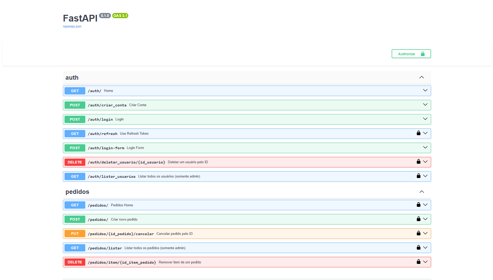

# 📦 api-pedidos-fastapi

API completa para gerenciamento de pedidos utilizando **FastAPI**, **JWT
Authentication**, **SQLAlchemy**, **Pydantic** e **SQLite**.

Este projeto simula um sistema de pedidos (como pizzaria, delivery ou
restaurante), permitindo criar usuários, realizar login, deletar usuários, listar usuários, criar pedidos,
adicionar itens, remover, cancelar e listar pedidos, tudo com
autenticação segura via JWT.

---

## 📸 Interface -- Swagger UI



---

## 🚀 Sobre o Projeto

O objetivo deste projeto é estudar e praticar desenvolvimento backend
com FastAPI e estruturado em arquitetura modular baseada em funcionalidades para aplicações FastAPI, e também aplicando boas práticas de API REST com:

- Autenticação via JWT
- Rotas protegidas
- Organização modular (auth, pedidos)
- Padrão controller → service → router
- Documentação automática com Swagger
- Persistência com SQLite

---

## 🛠 Tecnologias Utilizadas

- **Python 3.10+**
- **FastAPI**
- **SQLAlchemy**
- **Pydantic**
- **Uvicorn**
- **Passlib** (hash)
- **JWT (Json Web Token)**
- **SQLite**

---

## 📁 Estrutura do Projeto

### 🏁 Arquivos principais

- `main.py` → Inicializa a aplicação FastAPI, importa rotas e configurações globais.
- `requirements.txt` → Dependências do projeto.
- `README.md` → Documentação do projeto(essa).
- `.env` → Variáveis de ambiente (chaves JWT, configs do banco, etc.).
- `alembic/` → Migrações do banco de dados.
- `banco.db` → Banco SQLite gerado.

---

### 📦 app/

Pasta principal que contém toda a aplicação.

---

## 🔐 app/auth — Módulo de Autenticação

- `models.py` → Modelo ORM do usuário (id, nome, email, senha, admin, ativo).
- `schemas.py` → Estruturas Pydantic para entrada/saída (login, criação de usuário, retorno do usuário).
- `routes.py` → Rotas de autenticação (`/auth/login`, `/auth/criar_conta`, etc.).
- `__init__.py` → Torna o módulo importável.

---

## 🧠 app/core — Núcleo da aplicação

- `config.py`  
  → Carrega variáveis de ambiente, configura JWT, expiração de token, e informações globais da aplicação.

- `dependencies.py`  
  → Fornece dependências reutilizáveis, como obter usuário autenticado, validar token de acesso, buscar usuário no banco.

- `security.py`  
  → Responsável pela segurança: hashing de senha, verificação, criação de tokens JWT e funções auxiliares do sistema de autenticação.

---

## 🛒 app/pedidos — Módulo de Pedidos

- `models.py` → Modelos ORM: Pedido e ItemPedido.
- `schemas.py` → Estruturas Pydantic para criação, atualização e listagem de pedidos e itens.
- `routes.py` → Rotas para criar pedido, listar, adicionar item, remover item, cancelar pedido.
- `database.py` → Sessão do banco específica do módulo e utilidades relacionadas.
- `__init__.py` → Torna o módulo importável.

---

## 📂 Outros diretórios internos

- `__pycache__/`  
  → Arquivos de cache gerados automaticamente pelo Python (ignorar).

---

## 🧩 Endpoints Principais

### 🔐 Autenticação ( `/auth` )

| Método | Rota                               | Descrição                          |
| ------ | ---------------------------------- | ---------------------------------- |
| POST   | /auth/criar_conta                  | Cria um novo usuário               |
| POST   | /auth/login                        | Gera tokens (access + refresh)     |
| GET    | /auth/refresh                      | Gera um novo token                 |
| POST   | /auth/login-form                   | Login Estilo HTML(recebe FormData) |
| DELETE | /auth/deletar_usuario/{id_usuario} | Deleta usuário pelo id             |
| GET    | /auth/listar_usuarios              | Lista todos os Usuários            |

---

### 🛒 Pedidos ( `/pedidos` )

| Método | Rota                           | Descrição              |
| ------ | ------------------------------ | ---------------------- |
| POST   | /pedidos/                      | Cria um novo pedido    |
| PUT    | /pedidos/{id_pedido}/cancelar  | Cancela pedido pelo id |
| GET    | /pedidos/listar                | Lista todos os pedidos |
| DELETE | /pedidos/item/{id_item_pedido} | Deleta pedido pelo id  |

## 🗃️ Modelo do Banco de Dados

A estrutura atual utiliza SQLAlchemy ORM:

### Tabela: `usuarios`

- id
- nome
- email
- senha (hash)
- ativo
- admin

### Tabela: `pedidos`

- id
- id_usuario
- data_criacao
- status

### Tabela: `itens_pedido`

- id
- id_pedido
- sabor
- tamanho
- quantidade
- preco_unitario

## ⚙️ Como Executar o Projeto

Clone o repositório:

```bash
git clone https://github.com/cauathiagoo/api-pedidos-fastapi.git

cd api-pedidos-fastapi
```

Crie o ambiente virtual:

    python -m venv venv

Ative o ambiente:

- Windows

```{=html}
<!-- -->
```

    venv\ScriptsActivate

- Linux/Mac

```{=html}
<!-- -->
```

    source venv/bin/activate

Instale as dependências:

    pip install -r requirements.txt

Execute o servidor:

    uvicorn main:app --reload

Acesse no navegador:

    http://127.0.0.1:8000/docs

---

## 🔐 Autenticação (JWT)

A API usa autenticação **Bearer Token (JWT)**.

Fluxo de autenticação:

1.  Criar usuário → `/auth/criar_conta`
2.  Fazer login → `/auth/login`
3.  Copiar o **access_token** retornado
4.  Username e senha em _Authorize_ no Swagger
5.  Clicar em Authorize

---

## 🧑‍💻 Autor

Desenvolvido por [Cauã Thiago](https://cauathiago.netlify.app/)\
Freelancer & Dev Backend

📬 Contato:\
https://github.com/cauathiagoo
